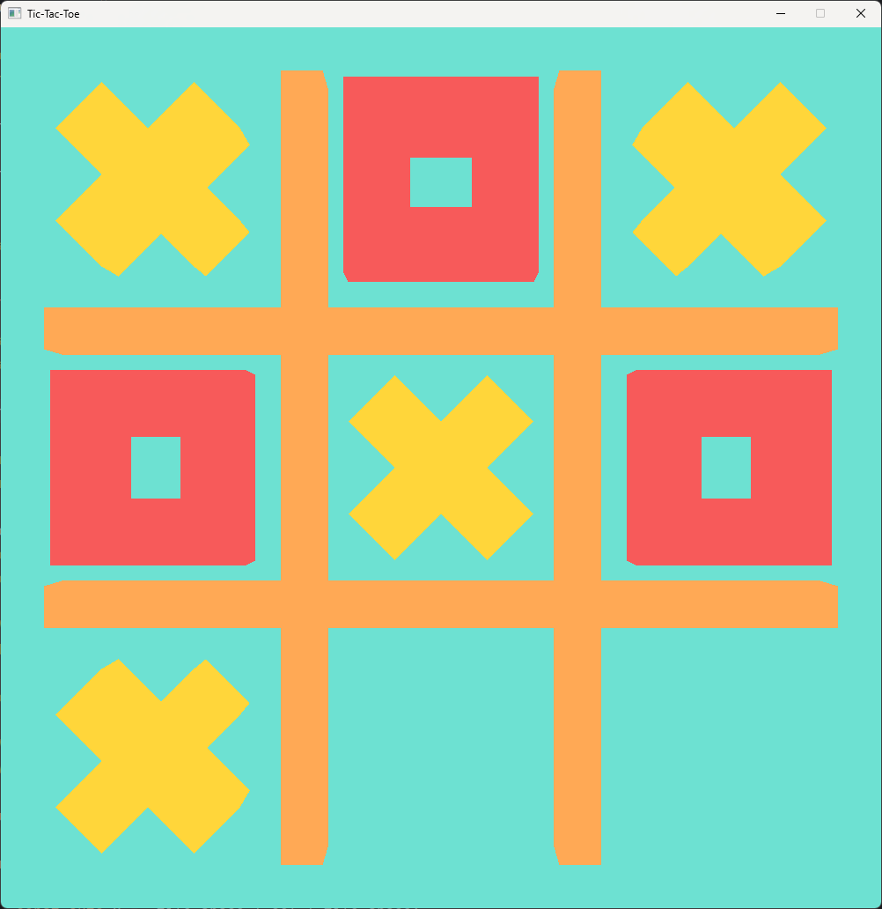

# Tic-Tac-Toe

Game developed live on our [YouTube](https://www.youtube.com/playlist?list=PLTBWjr8hHbdpq-5MNiSVT9Puh6iP2xzf7) channel.

Check out the full game description on [Wikipedia](https://en.wikipedia.org/wiki/Tic-tac-toe).

## Tasks

- [ ] Create a File class to read simple text
- [ ] Move PhysicsDebug into a separate file
- [ ] Create a Board class
- [ ] Create a Window class
- [ ] Create Window Events class
- [ ] Create a Shader (Stage) class
- [ ] Create a Program (Shader) class
- [ ] Create an Importer class for 3d Models on top of assimp
- [ ] Create a Vertex Array class
- [ ] Create a Buffer class
- [ ] Optimize the ray creation for the physics raycast
- [ ] Create a Physics class?
- [ ] Create a GL Pipeline class
- [ ] Make use of Uniform buffers